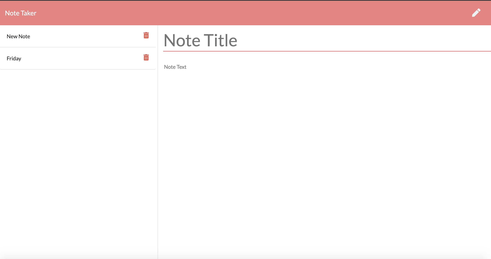

# note-taker

## Description

For users that need to keep track of a lot of information, it's easy to forget or be unable to recall something important. Being able to take persistent notes allows users to have written information available when needed.

I built a note-taking application for users that need to keep track of a lot of information. The application allows the user to take notes and have written information available when needed. 

The application functions by:

* Allowing users to create and save notes

* View previously saved notes

* Delete previously saved notes

## Table of Contents
* [Usage](#Usage)
* [Demonstration](#Demonstration)
* [Technologies](#Technologies)
* [Deployed](#Deployed)
* [Developer](#Developer)

## Usage

To use the application go to the [deployed link](#Deployed). 

## Demonstration

 
## Technologies
* HTML
* CSS
* Bootstrap
* JavaScript
* Express
* UUID

## Deployed

https://mighty-shelf-20145.herokuapp.com/

## Developer

Megan Coppins

https://meganlcoppins.github.io/note-taker/

